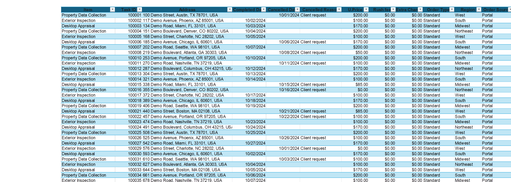
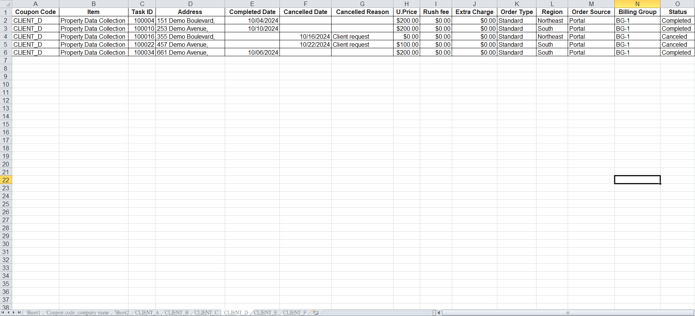
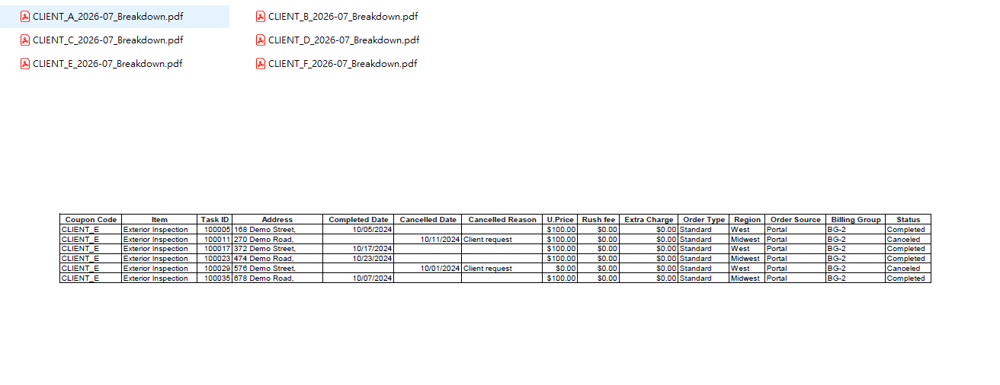

# Excel Client Report Automation

> Excel VBA automation for transforming 20,000+ monthly order records into client-specific, print-ready PDF reports.

| Monthly Volume | Client Reports |  Processing Time | Time Reduction |
| -------------- | -------------: | ---------------: | -------------: |
| 20,000+ orders |  40–50 clients | 4+ hrs → <30 min |           87%+ |

## Project Overview

This project automates an end-to-end monthly client reporting workflow using Excel VBA.

A master order spreadsheet containing more than 20,000 order records must be separated into individual client reports every month. The automation cleans and standardizes the source data, separates orders by client, consolidates related client codes under the appropriate billing entity, prepares each report for printing, and exports an individual PDF for each client.

The resulting workflow supports approximately 40–50 client reports per month and reduces processing time from at least four hours to under 30 minutes.

---

## Business Challenge

Each month, client order data had to be separated from a master order spreadsheet and prepared as individual client reports.

The process was largely manual and required at least **four hours each month** to organize the data, verify order accuracy, and prepare the reports. As the number of clients increased, the time required to break down and validate the orders grew accordingly, making the workflow increasingly difficult to scale.

Each final report also had to meet specific delivery requirements:

* Include only the orders belonging to the individual client
* Be verified for accuracy before delivery
* Be formatted for printing
* Be delivered as a PDF

The challenge was therefore not simply generating reports, but creating a repeatable process that could **accurately separate client-level order data, standardize the output, and reduce the manual workload as the client base grew**.

---

## Solution

I developed a VBA-based workflow to automate the monthly client order reporting process from data preparation through PDF export.

The automation:

### 1. Cleans and Standardizes the Source Order Data

Before generating client reports, the workflow prepares the source spreadsheet by:

* Removing unnecessary fields such as `Subtotal`, `Item Code`, and `Note`
* Excluding non-order charge rows such as `Rush Fee` and `Extra Charge`
* Standardizing `Returned` records as `Canceled`
* Applying consistent date and currency formatting

### 2. Separates Orders into Individual Client Worksheets

Orders are grouped based on client codes, with each client receiving a dedicated worksheet containing only its own order records.

### 3. Consolidates Multiple Client Codes Under the Same Billing Entity

When multiple client codes belong to the same parent company or billing entity, the automation combines those orders into a single client worksheet instead of generating separate reports.

### 4. Maps Internal Client Codes to Client-Facing Company Names

A separate mapping table is used to convert internal client codes into the appropriate company names for reporting.

### 5. Standardizes the Report Layout for Printing

Each client worksheet is formatted as an A4 landscape report, with all columns fitted to a single page width and margins, text wrapping, and row sizing adjusted for readability.

### 6. Exports Individual Client Reports as PDFs

Each completed client worksheet is exported as an individual PDF using a standardized monthly file-naming convention.

---

## Workflow

```text
Monthly Master Order Spreadsheet
              │
              ▼
     Clean & Standardize Data
              │
              ▼
       Split by Client Code
              │
              ▼
   Consolidate Billing Entities
              │
              ▼
        Map Client Names
              │
              ▼
         Format for Print
              │
              ▼
      Export Individual PDFs
              │
              ▼
   40–50 Client-Ready Reports
```

The operational workflow was reduced to:

**Download Monthly Order Spreadsheet → Open in Excel → Run VBA Automation → Generate Client PDFs**

---
## Demo

The screenshots below use fictional portfolio data that follows the same structure and workflow as the production dataset. No actual client or production order data is shown.

### 1. Monthly Order Data

The workflow starts with a master spreadsheet containing order records across multiple clients.



*Fictional portfolio dataset representing the structure of the monthly production order spreadsheet.*

### 2. Automated Client Report Generation

The VBA workflow cleans and standardizes the source data, then separates the orders into individual client worksheets.



*Example of client-specific worksheets automatically generated from the master order data.*

### 3. Generated PDF Reports

After client-level processing and print formatting, the automation exports an individual PDF report for each client.



*Example of automatically generated client-specific PDF reports using fictional portfolio data.*

---

## Key Implementation

### Automated Data Preparation

The workflow creates a working copy of the monthly order data and standardizes it before client-level processing begins.

This prevents repetitive cleanup from being performed independently for every client report and ensures that all downstream reports use the same standardized dataset.

### Dynamic Client Report Generation

The automation identifies client codes in the cleaned dataset and dynamically generates client-specific worksheets.

Only records associated with the relevant client are included in each worksheet, eliminating repetitive manual filtering and copying.

### Multi-Code Billing Consolidation

The reporting logic accounts for situations where multiple client codes ultimately belong to the same parent company or billing entity.

For example, production client identifiers have been anonymized in this portfolio as:

```vb
Case "CLIENT_A", "CLIENT_A_ALT"
    Set wsTarget = GetOrCreateSheet(wb, "Client A", wsSource)
```

Both client identifiers are therefore consolidated into a single `Client A` report.

### Client Name Mapping

Internal client identifiers are separated from client-facing naming through a mapping table.

This allows reporting names to be maintained independently from the core order-processing logic.

### Standardized PDF Output

The automation applies consistent print settings before generating the final reports, including:

* A4 paper size
* Landscape orientation
* Single-page-width scaling
* Standardized margins
* Text wrapping
* Automatic row sizing

Each client worksheet is then exported as an individual PDF.

---

## Business Impact

The VBA automation significantly reduced the time and manual effort required to prepare monthly client order reports.

### Before Automation

The reporting workflow required at least **4 hours per month** of manual processing, including data preparation, client-level order breakdown, verification, formatting, and PDF preparation.

### After Automation

The complete workflow can now be completed in **under 30 minutes**.

The routine manual verification step was also removed from the monthly process because the client allocation and report-generation logic is handled consistently by the automation.

### Results

* **87%+ reduction in monthly processing time**
* Reduced processing time from **4+ hours to under 30 minutes**
* Processes **20,000+ order records per month**
* Supports approximately **40–50 clients per month**
* Generates one client-specific PDF for each client
* Eliminates repetitive manual filtering, copying, and report formatting
* Removes routine manual verification from the monthly workflow
* Creates a more scalable reporting process as the client base grows

---

## Tech Stack

* Microsoft Excel
* VBA
* Excel worksheet automation
* PDF export automation
* AI-assisted development

---

## My Role

I identified the reporting bottleneck and defined the automation requirements based on the existing monthly workflow.

My responsibilities included:

* Defining the client-reporting workflow and business rules
* Identifying which source data should be retained, removed, or standardized
* Defining client-code consolidation and billing relationships
* Designing the required client-level report output
* Using AI-assisted development to accelerate VBA implementation
* Testing and refining the automation against the operational workflow
* Implementing the automation into the recurring monthly reporting process

---

## AI-Assisted Development

AI tools were used to accelerate VBA code generation and troubleshooting.

The business requirements, reporting logic, client allocation rules, output requirements, testing criteria, and final workflow were defined and validated based on the actual operational process.

AI-generated code was reviewed, tested, and refined before being incorporated into the production workflow.

---

## Privacy & Confidentiality

This repository is presented as a portfolio case study.

All client names, client codes, and other business-sensitive identifiers shown in the portfolio version have been **anonymized or replaced with representative placeholders**.

Examples such as `CLIENT_A`, `CLIENT_A_ALT`, and `Client A` do not represent actual client identities.

No confidential client data or production order data is included.
